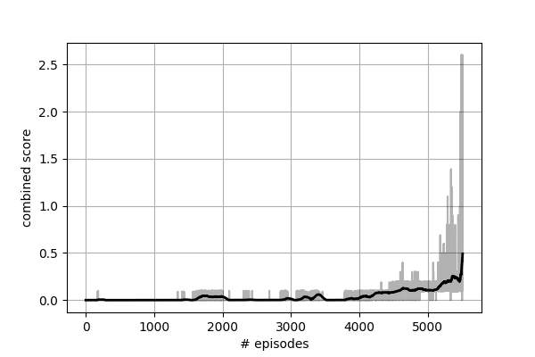

# Continuous control with DDPG

In this project I applied the [multi-agent deep deterministic policy gradient](https://arxiv.org/abs/1706.02275) algorithm to the task of teaching two agents how to play tennis cooperatively - the longer they keep the ball in the game, the higher their reward.
  
### Methods
##### Environment
In this environment, two agents control rackets to bounce a ball over a net. If an agent hits the ball over the net, it receives a reward of +0.1.  If an agent lets a ball hit the ground or hits the ball out of bounds, it receives a reward of -0.01.  Thus, the goal of each agent is to keep the ball in play.

The observation space consists of 8 variables corresponding to the position and velocity of the ball and racket. Each agent receives its own, local observation, consisting of the concatenation of three time steps, for a total of 24 features. Two continuous actions are available, corresponding to movement toward (or away from) the net, and jumping.

The task is episodic, and in order to solve the environment, the agents must get an average score of +0.5 (over 100 consecutive episodes, after taking the maximum over both agents). Specifically,

- After each episode, we add up the rewards that each agent received (without discounting), to get a score for each agent. This yields 2 (potentially different) scores. We then take the maximum of these 2 scores.
- This yields a single **score** for each episode.

The environment is considered solved, when the average (over 100 episodes) of those **scores** is at least +0.5.

The maximum number of steps for this environment is 5000, and this is what I have used in all the results below. It's worth noting that since the reward is cumulative, choosing a different (smaller) maximum number of steps will result in a smaller expected reward per episode.

  
##### MADDPG
[MADDPG](https://arxiv.org/abs/1706.02275) is a straight-forward extension of [DDPG](https://arxiv.org/abs/1509.02971) to multi-agent environments. Traditional reinforcement learning methods cannot be directly applied to multi-agent scenarios. The actions of other agents in the environment will increase the variability of each agent's reward, leading to an increased variance of the gradient, which will prevent policy gradient methods to converge. The Q-learning family of algorithms will also not converge because of the assumption of a stationary environment. That assumption is invalidated when agents continuously change their policy while learning. The main reason why MADDPG works is because the critic network of each agent takes as input the states and actions of all agents, therefore explaining the variance in the environment. Since each critic is driven by the individual reward of each agent, the agents can learn any reward function, be it competitive, cooperative, or mixed. The actor network is the same as in DDPG and only takes local observations as input. The authors also propose to train multiple policies per agent, but in this project I only trained one.

  
##### Actor network
For the actor network I used a feed-forward network with 3 fully-connected layers followed by batch normalization layers and ReLU activations. The first layer takes as input the 24-dimensional state. The last layer outputs a 2-dimensional action. The layer sizes were:

1. BN -> 24 -> 400 -> BN -> ReLU
2. 400 -> 300 -> BN -> ReLU
3. 300 -> 2
 
 

##### Critic network
The critic network is based on the same 3 fully-connected layers structure as the actor network. The first layer takes as input the states of both agents, so a vector of 48 elements. The actions of both agents (a 4-element vector) are added in the second layer. The last layer outputs a one-dimensional (state-action) estimated return. The layer sizes were:

1. BN -> 48 -> 400 -> BN -> ReLU
2. 404 -> 300
3. 300 -> 1
 
 

##### Hyperparameters and optimizers
I used the Adam optimizer with the default settings and no decay. The same seed was used for all experiments. The hyperparameters used are as follows:
- Replay buffer size: 1e6
- Batch size: 128
- Discount factor: 0.99
- Soft update mix: 1e-3
- Actor learning rate: 1e-4
- Critic learning rate: 1e-4
 
 

### Results
I first tried to solve the environment using only one DDPG agent for controlling both rackets. Learning was quite fast, but the agent didn't converge. The MADDPG agents did not exhibit the same synchronicity in learning. Note how one of them started improving around the same time as DDPG had its peak, but since the other agent could not keep the ball in play, 2000 more episodes were needed until both MADDPG agents could improve jointly. Finally, the agents solved the environment in 5413 episodes - the plot below shows the average scores of each agent, which are slightly lower than the combined score.
  

  

The combined score of MADDPG is shown below.
  

  

### Future improvements
- Any improvement to DDPG can potentially improve the performance of MADDPG. Most promising would be a single-agent model like [TD3](https://arxiv.org/abs/1802.09477), which addresses DDPG's overestimation of (state, action) pairs.
- Hyperparameter tuning is another way to squeeze more performance.